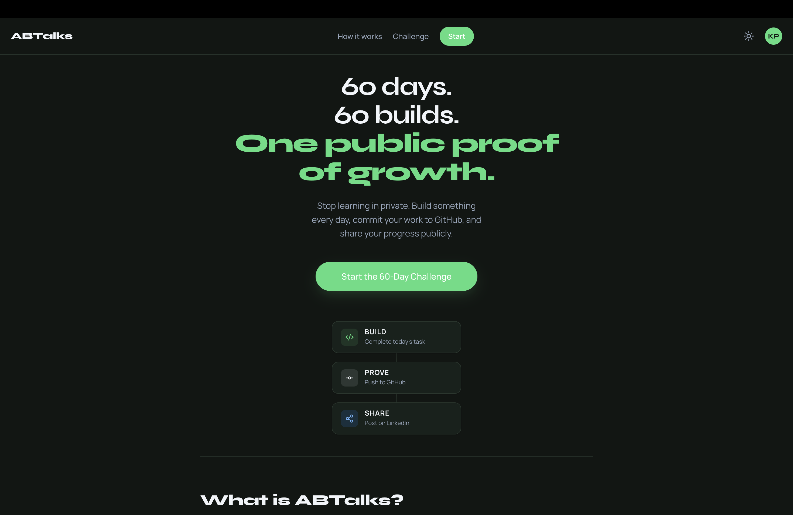
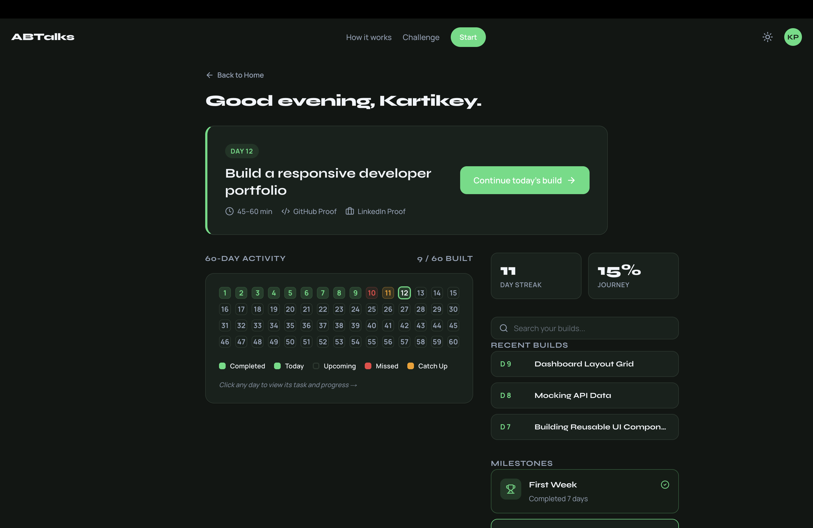
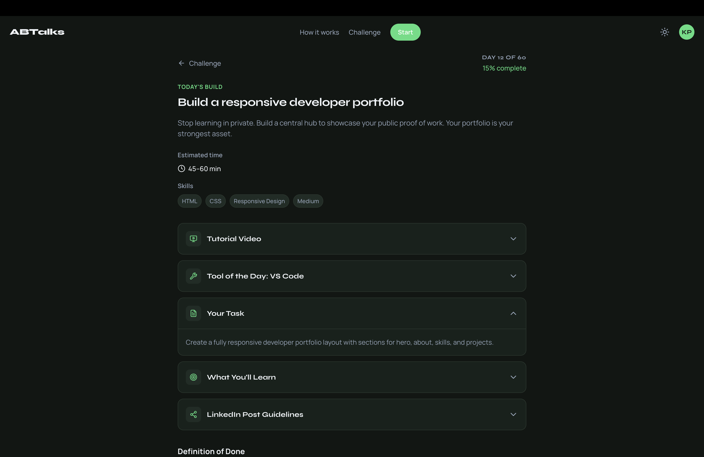
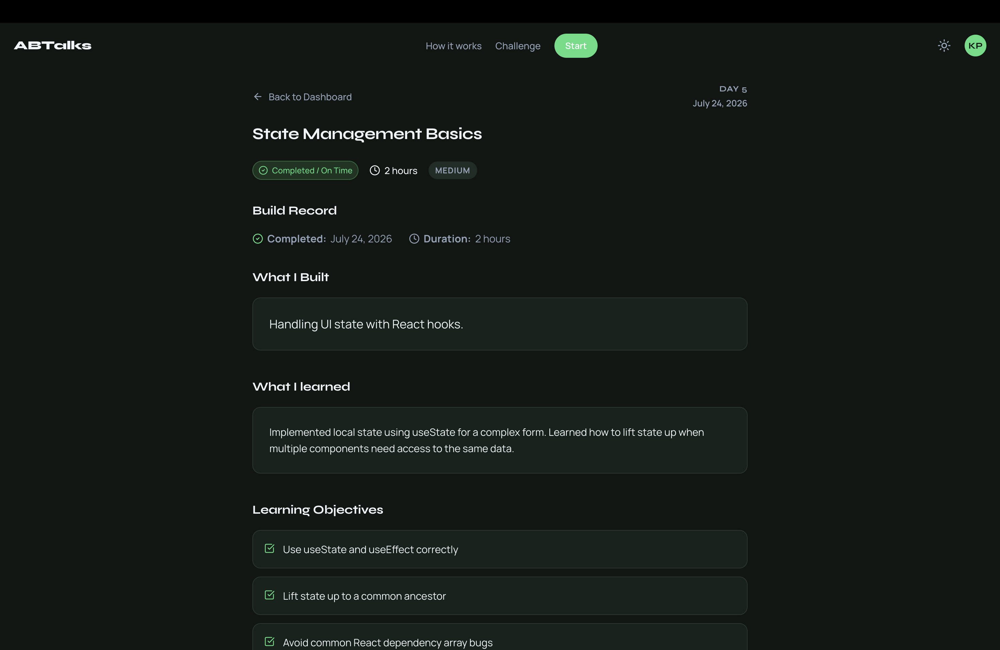
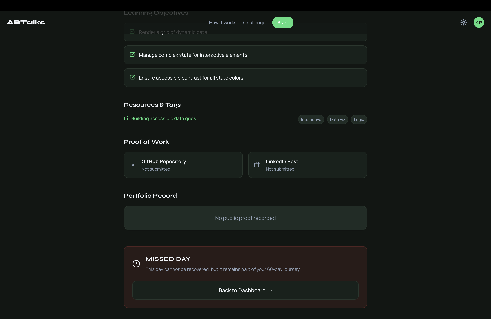
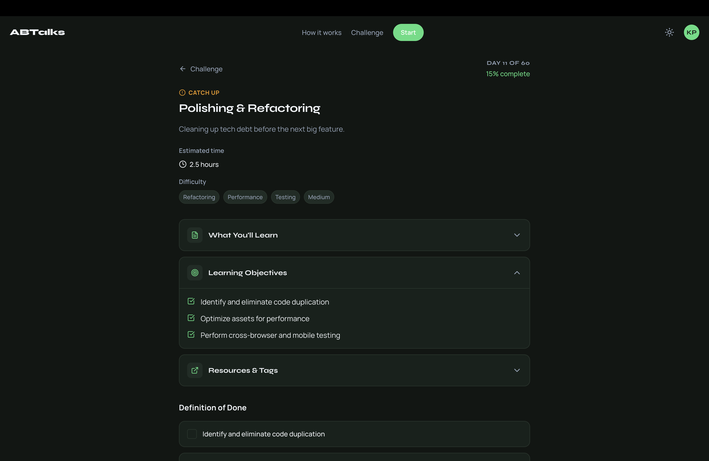

# ABTalks
**Stop watching tutorials. Start building proof.**

## Problem
The modern developer ecosystem has a tutorial consumption problem. Developers spend months learning syntax but struggle to build complete applications. They lack consistent practice, often abandon half-finished side projects, and most importantly, they lack visible, public proof of their skills to show employers and peers.

## Solution
ABTalks flips the model from passive learning to active building. Every single day for 60 days, builders are given a focused challenge. They learn the necessary tool, build the requirement, fulfill a strict Definition of Done, and are required to post their proof (GitHub commits and LinkedIn updates) before they can mark the day as complete. It turns learning into a relentless daily habit of building and sharing.

## Key Features
- **High-Converting Landing Page**: A premium product introduction detailing the Build → Prove → Share philosophy, complete with a 60-day journey preview and social proof.
- **Student Dashboard (Command Center)**: A personalized builder workspace showing active streaks, completed milestones, and a comprehensive 60-day activity grid.
- **State-Aware 60-Day Grid**: An interactive activity matrix that tracks and color-codes days based on their status (Completed, Today, Upcoming, Missed, Catch-Up).
- **Milestone Tracking**: Visual achievement badges (e.g., "10 Builds Shipped", "30 Day Builder") that unlock based on real student progress.
- **Day-Specific Challenge Pages**: Dedicated workspaces for every day in the journey, dynamically adapting based on the day's status.
- **Completed Day Journals**: Read-only portfolio views of past tasks, showcasing "What I Built", learning objectives, and the submitted public proof.
- **Missed & Catch-Up Flows**: Graceful handling of broken streaks with distinct UI states for days that were missed entirely versus days that can still be recovered.
- **Day 12 Learning & Submission Workflow**: A fully interactive prototype of a daily challenge, featuring a YouTube embed, interactive Definition of Done checklists, optional learning reflections, and rigorous form validation.
- **GitHub & LinkedIn Proof of Work**: Dedicated submission flows requiring public URLs for code repositories and social posts before a challenge can be completed.
- **Mock Student Identity**: A lightweight personalized experience (e.g., "Kartikey Patel") driven entirely by JSON, requiring no complex backend authentication for demonstration.
- **Native Dark/Light Theme**: A robust, persistent theme toggle supported by CSS variables, ensuring high readability and WCAG accessibility across both modes.
- **390px Mobile-First Responsive Design**: Engineered specifically to look premium on mobile devices before gracefully scaling up to desktop widths.
- **Global Navigation & Footer**: Shared, responsive layout components providing persistent access to the theme toggle, dashboard, and social links.

## Product Walkthrough

### 1. Home — Product Introduction
ABTalks is not another course library. It focuses on shipping work and creating public evidence of growth. The landing page outlines the 60-day build philosophy and the core Build → Prove → Share flow.



### 2. Dashboard — Builder Command Center
The personalized dashboard tracks your streak, overall progress, and milestones. The 60-Day Activity grid is fully interactive, color-coding completed, missed, and current days. 



### 3. Day 12 — Today's Build
An active daily challenge page. It provides the learning materials, the build requirements, and an interactive Definition of Done checklist. A day can only be submitted once the checklist is complete and valid GitHub/LinkedIn proof URLs are provided.



### 4. Completed Day — Development Journal
Once a day is submitted, it turns into a read-only development journal. It serves as a historical record of what was learned, the objectives completed, the resources used, and permanent links to the public proof of work.



### 5. Missed Day — Honest Progress
Progress requires honesty. If a day is missed and cannot be caught up, it is permanently recorded as missed. There is no fake completion and no empty proof submitted.



### 6. Catch-Up Day — Recover Momentum
If a day was missed recently, it enters a dedicated catch-up workflow. Builders are encouraged to recover their momentum and can still submit their proof to get back on track.



### 7. Responsive & Theme Support
ABTalks was engineered with a strict 390px mobile-first design, ensuring all interactive grids, proof submissions, and dashboards feel native on a phone while gracefully scaling to desktop. It also features a fully persistent Dark/Light theme toggle.

*(Responsive & theme screenshots to be added)*

## Flow (Core Flow)
1. **Choose a daily challenge**: Open the dashboard to see today's task.
2. **Learn**: Watch a curated, focused video tutorial.
3. **Build**: Implement the task using the newly learned tool.
4. **Complete Definition of Done**: Check off the strict technical requirements.
5. **Commit to GitHub**: Push the code to a public repository.
6. **Share on LinkedIn**: Build a personal brand by sharing the daily progress.
7. **Record progress**: Submit the proof links to mark the day complete.
8. **Continue the journey**: Watch the streak grow and unlock the next day.

## Tech Stack

| Category | Technology |
| :--- | :--- |
| **Framework** | Next.js (App Router, Turbopack) |
| **Language** | TypeScript, HTML5 |
| **Styling** | Vanilla CSS (CSS Modules & Global Variables) |
| **UI & Icons** | Lucide-React (SVG Icons) |
| **Data Architecture** | Local JSON files (Mocked Data Layer) |
| **Tooling & Build** | Node.js, npm, ESLint |

*(Note: ABTalks uses a completely custom, lightweight design system built from scratch with Vanilla CSS. No heavy component libraries like Tailwind or Material UI were used.)*

## Architecture

### Project Structure
```text
src/
├── app/                  # Next.js App Router definitions
│   ├── dashboard/        # Student dashboard route
│   ├── day/[id]/         # Dynamic daily challenge route
│   ├── globals.css       # Global theme variables and base styles
│   ├── layout.tsx        # Root layout, ThemeProvider, and global Footer
│   └── page.tsx          # Landing page route
├── components/           # Reusable React components
│   ├── challenge/        # Day challenge specific UI (Proof, Journals, Checklists)
│   ├── dashboard/        # Dashboard specific UI (Milestones, Activity Grid)
│   ├── landing/          # Home page sections (Hero, Benefits, Builder Voices)
│   ├── shared/           # Global elements (Header, Footer)
│   └── ui/               # Base design system (Button, Badge, Card, Progress)
├── data/                 # Mock database layer (JSON)
│   ├── challenge.json    # Base challenge structure
│   ├── completed-days.json # Mock data for past days
│   ├── day12.json        # Detailed content for Day 12 prototype
│   └── student.json      # Mock identity and streak data
└── lib/                  # Utility functions
```

### Day State Architecture
A core engineering feature of ABTalks is the day-state resolver. Both the Dashboard grid and the individual `/day/[id]` pages share logic to determine a day's status:
- **Completed**: The user successfully submitted their proof. Renders as a green read-only portfolio journal.
- **Today (Current)**: The active challenge for the day. Renders an interactive form requiring a Definition of Done and Proof URLs.
- **Upcoming**: Future days locked to prevent rushing. Renders a locked placeholder.
- **Missed**: Days where the user failed to submit proof in time. Renders a permanent red "Missed Day" warning.
- **Catch-up**: Days that were missed but are currently eligible for recovery submission.

## Routes

| Route | Purpose |
| :--- | :--- |
| `/` | The public-facing landing page outlining the ABTalks philosophy and product offering. |
| `/dashboard` | The authenticated student command center showing progress, streaks, and the 60-day activity matrix. |
| `/day/[id]` | The dynamic route for individual challenges. Automatically morphs its UI depending on whether the day is completed, missed, current, or upcoming. |

## Setup (Getting Started)

To run ABTalks locally:

```bash
# Clone the repository
git clone https://github.com/Fah218/ABTalkRebuild.git

# Navigate into the project directory
cd ABTalkRebuild

# Install dependencies
npm install

# Start the development server
npm run dev
```

Open [http://localhost:3000](http://localhost:3000) with your browser to see the result.

## Deployment
*(Deployment information and production URLs will be added here once the project is deployed to a hosting provider like Vercel.)*

## AI Usage
For detailed information on the prompts and AI assistance used to generate this prototype, please view [PROMPT.MD](PROMPT.MD) and [AI_USAGE_LOG.md](AI_USAGE_LOG.md).

## Future Improvements
- **Backend Integration**: Replace the local JSON data layer with a real database (e.g., PostgreSQL or Firebase) to persist user accounts and submissions.
- **Authentication**: Add robust user authentication and authorization.
- **Automated Verification**: Implement GitHub API webhooks to automatically verify that code was actually pushed, rather than relying on manual URL submission.
- **Social Graph**: Allow students to see and applaud each other's daily proofs.
